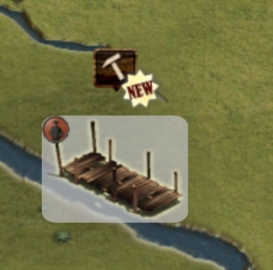
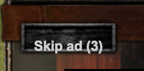

## Install URL

[Click here to install](https://the-west-scripts.github.io/tw-perseus-toolkit/script.user.js)

## Description & Sreenshots

Userscript for The West. Provides useful features.

**Highlight Silver / Gold Jobs**  
Highlight Silver / Gold Jobs (it doesn't search them by it's own)  

**Skip cinema videos**  
Button to skip cinema videos after 5 seconds  

**Zoom**  
Zoom the map in and out (hover the minimap icon on the top right and scroll up / down)

**Disable premium notifications**  
Disable premium notifications for energy (refill) and automation.

**9x 15sec**  
Button in job windows which allows you to start 9x 15 second jobs with one click.

**Hide "Drawing Map" flag**  
Hide flag "Drawing map" which bugs out sometimes and doesn't disappear even if the map is loaded.

**Show online / idle status in saloon**  
Show online / idle status for people in Saloon chat.

## Comments

[Report a bug](https://github.com/The-West-Scripts/tw-perseus-toolkit/issues/new)

[Greasyfork listing](https://greasyfork.org/en/scripts/370137-the-west-perseus-toolkit)

## Installation

Install first the browser extension for your browser:

-    Firefox: [Greasemonkey](https://addons.mozilla.org/firefox/addon/greasemonkey/)
-    Chrome: [Tampermonkey](https://chrome.google.com/webstore/detail/tampermonkey/dhdgffkkebhmkfjojejmpbldmpobfkfo/)
-    Microsoft Edge: [Tampermonkey](https://www.microsoft.com/store/p/tampermonkey/9nblggh5162s/)
-    Safari: [Tampermonkey](https://safari.tampermonkey.net/tampermonkey.safariextz)
-    Opera: [Tampermonkey](https://addons.opera.com/extensions/details/tampermonkey-beta/)

Now install the user script.

**Smartphones & Tablets**

-   Create a new bookmark in your mobile browser
-   Edit the bookmark and copy this to its address field:

`javascript:document.body.appendChild(document.createElement('script')).src='https://the-west-scripts.github.io/tw-perseus-toolkit/script.user.js'`

-   Now open the game and click the bookmark to start the script
